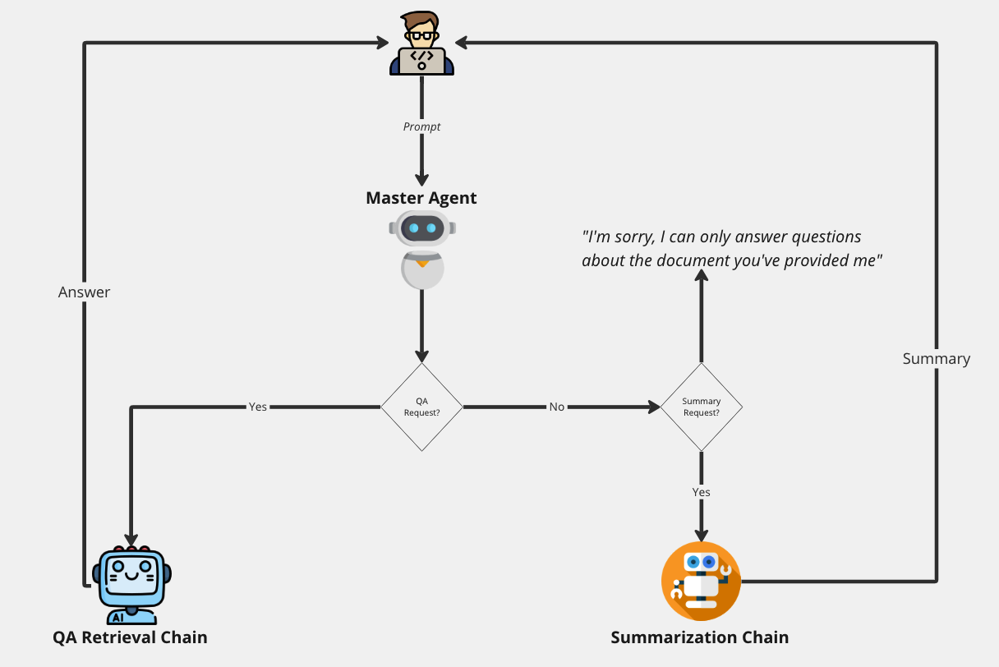

# PDFChat
- [PDFChat](#pdfchat)
  - [Requirements](#requirements)
  - [Running](#running)
  - [How It Works](#how-it-works)
    - [Why use master-child architecture?](#why-use-master-child-architecture)
  - [Demo](#demo)
- [Tutorial](#tutorial)

1. Ask general questions about the contents of a PDF: These are questions that don't require summarization.
        Instead, these questions require that PDFBot look through the contents of the PDF to answer the user's
        question.

2. Ask PDFchat to summarize the document for you, at which point it'll allow you to download a sumamry PDF and a change diff in HTMl


## Requirements
* Python 3.10
* Streamlit 1.25
* An OpenAI API key

## Running
1. Create virtual environment
```
virtualenv pdf_bot
```

2. Create a `.streamlit` folder at the root of the repository and add a `secrets.toml` file to it
3. Add `OPENAI_API_KEY = "<YOUR-OPEN-AI-KEY>"` to your `secrets.toml` file
4. Run as streamlit app
```
streamlit run pdf_chat/streamlit_app.py
```

## How It Works
The bot is made up of three components, a master agent and two child agents. They interact in the following manner:
    
1. Master OpenAI Functions agent: This agent takes in a user prompt and delegates the task to one of the two bots it has access to using langchain's OpenAIFunctions Agent (see points two and three). It's a simple chat agent with memory, enabling a chat-like interface between the user and the bot
    
2. QA Retrieval Agent: This agent handles general questions about the contents of a PDF. Does so using Langchain's ConversationalRetrievalChain, which stores different document parts as embeddings in a vectore store, and performs a similarity search between these embeddings and the user's prompt. See here for more https://python.langchain.com/docs/use_cases/question_answering/

3. Summarization Agent: This agent handles the summarizatin of the PDF. Does so by using langchain's MapReduceDocumentsChain, which uses Map-Reduce to summarize all splits of document (Map) before combining them to produce one full summary of the entire document (Reduce). See here for more https://python.langchain.com/docs/use_cases/summarization



### Why use master-child architecture?
1. All prompts sent to agents are much smaller since there's no requirement of constantly pre-pending the entire document to the prompt for the agent to have context. Smaller prompt means, incurring less costs and allowing for the master agent's memory not to get flooded
2. It's more modularized, so we aren’t restricted to a single model. You can use different models based on the different requirements of the agents

## Demo
You can find an example PDF under the examples folder. Types of questions you can ask:

1. How can the definition of demand change based on who is defining it?
2. What is demand?
3. Summarize this document for me

The bot is tuned not to answer questions that don't pertain to the document. Questions like the following won't be answered:
1. How many continents are their?
2. What is water?

# Tutorial
You can set of detailed steps have been written on in `pdf_chat/chatbot.py`. Your task is to create the master agent and the QA retrieval chain. Creating the summarization chain is not part of the tutorial, and is left as an example for the developer to use